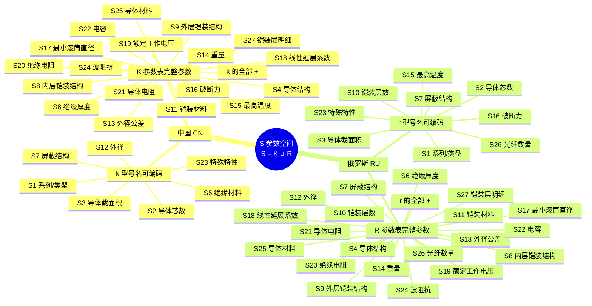

# 中俄测井电缆映射 · 数据分类框架

## 思维导图



## 四个集合

| 符号 | 全称 | 含义 | 数据来源 |
|:----:|------|------|----------|
| **k** | CN Name Fields | 从中国型号名字符串能直接解析出的参数 | 型号名解析器 `parseChinese()` |
| **K** | CN Spec Fields | 中国产品规格书/参数表中包含的全部参数 | `cn-products.json` |
| **r** | RU Name Fields | 从俄罗斯型号名字符串能直接解析出的参数 | 型号名解析器 `parseRussian()` |
| **R** | RU Spec Fields | 俄罗斯产品规格书/参数表中包含的全部参数 | `ru-products.json` |

## 核心关系

```
k ⊆ K          型号名能编码的永远是参数表的子集
r ⊆ R          同理
S = K ∪ R      统一参数空间是两边参数表的并集
```

## 映射流程

```
用户输入型号名 ──→ 解析器提取 k 或 r 子集 ──→ 用提取的参数筛选数据库 ──→ 返回对侧匹配结果
                                                                           ↓
                                              ← 映射间隙分析：哪些 S 参数缺失，需要补充 ←
```

## S1–S27 完整分类表

| 参数 | 含义 | k | K | r | R |
|------|------|:-:|:-:|:-:|:-:|
| S1  | 系列/类型 | ✓ | ✓ | ✓ | ✓ |
| S2  | 导体芯数 | ✓ | ✓ | ✓ | ✓ |
| S3  | 导体截面积 mm² | ✓ | ✓ | ✓ | ✓ |
| S4  | 导体结构（根数×丝径） |   | ✓ |   | ✓ |
| S5  | 绝缘材料 | ✓ | ✓ |   |   |
| S6  | 绝缘厚度 mm |   | ✓ |   | ✓ |
| S7  | 屏蔽结构 | ✓ | ✓ | ✓ | ✓ |
| S8  | 内层铠装结构 |   | ✓ |   | ✓ |
| S9  | 外层铠装结构 |   | ✓ |   | ✓ |
| S10 | 铠装层数 |   |   | ✓ | ✓ |
| S11 | 铠装材料 |   | ✓ |   | ✓ |
| S12 | 外径 mm | ✓ | ✓ |   | ✓ |
| S13 | 电缆外径公差 |   | ✓ |   | ✓ |
| S14 | 重量 kg/km |   | ✓ |   | ✓ |
| S15 | 最高温度 °C |   | ✓ | ✓ | ✓ |
| S16 | 破断力 kN |   | ✓ | ✓ | ✓ |
| S17 | 最小滚筒直径 mm |   | ✓ |   | ✓ |
| S18 | 线性延展系数 |   | ✓ |   | ✓ |
| S19 | 额定工作电压 V |   | ✓ |   | ✓ |
| S20 | 绝缘电阻 MΩ/km |   | ✓ |   | ✓ |
| S21 | 导体电阻 Ω/km |   | ✓ |   | ✓ |
| S22 | 电容 pF/m |   | ✓ |   | ✓ |
| S23 | 特殊特性 | ✓ | ✓ | ✓ | ✓ |
| S24 | 波阻抗 Ω |   | ✓ |   | ✓ |
| S25 | 导体材料 |   | ✓ |   | ✓ |
| S26 | 光纤数量 |   |   | ✓ | ✓ |
| S27 | 铠装层明细（数组） |   | ✓ |   | ✓ |

> 此表的机器可读版本存储在 `src/data/s-schema.json` 中，每个字段的 `k`/`K`/`r`/`R` 布尔值即为上表的打勾项。启动指令为npm run dev。

### S27 兼容规则

为兼容 2 层以上铠装而不破坏历史数据，新增 `S27 = armorLayers` 作为规范表示，类型为数组；旧字段继续保留：

- `S8` = 第 1 层铠装结构（兼容投影）
- `S9` = 第 2 层铠装结构（兼容投影）
- `S10` = 铠装总层数
- `S11` = 公共铠装材料；若各层材质不一致，可为空并以 `S27` 为准

推荐 `S27` 元素结构如下：

```json
[
  { "index": 1, "kind": "armor", "structure": "6x0,75", "material": "碳钢", "note": null },
  { "index": 2, "kind": "armor", "structure": null, "material": "碳钢", "note": "family-defined second layer" }
]
```

---

## 推理映射对（Inference Mapping Pairs）

### 设计动机

当前代码已经支持**部分推理匹配**，但完整推理链尚未全部落地。很多情况下，用户输入的型号名只能解析出 k 或 r 子集（5–7 个参数），如果没有额外推理，仍然会导致对侧候选列表为空或过多。

如果引入参数间的物理/工程推理关系，就可以从已知参数**推断出**未知参数，扩大筛选维度，同时在 UI 上区分两种命中类型：

| 标签 | 含义 | 可信度 |
|------|------|--------|
| **直接匹配** | 所有筛选条件均来自型号名解析或参数表原始值 | 高 |
| **推理匹配** | 部分筛选条件由推理映射链补全 | 中（需展示推理依据） |

### 推理映射链一览

> 方向标注：`→` 单向推理 ｜ `↔` 可逆推理

| # | 输入参数 | → | 输出参数 | 方向 | 推理依据 |
|---|---------|---|---------|:----:|---------|
| 1 | S5 绝缘材料 + S6 绝缘厚度 | → | S15 最高温度 | → | 绝缘材料的耐温等级直接决定线缆温度上限（B→90°C, F40→180°C, F46→230°C, F46/F40→260°C, PFA→280°C） |
| 2 | S5 绝缘材料 + S6 绝缘厚度 | → | S19 额定工作电压 | → | 绝缘材料介电强度 × 厚度 ≈ 击穿电压，再取安全系数得额定电压 |
| 3 | S5 绝缘材料 + S6 绝缘厚度 | → | S20 绝缘电阻 | → | 绝缘电阻 = 材料体积电阻率 × 几何因子（厚度/面积） |
| 4 | S2 芯数 + S3 截面积 + S25 导体材料 | → | S21 导体电阻 | ↔ | R = ρL/A，已知材料电阻率和截面积可算电阻；当前实现在 `S25` 缺失时可先按 `S2+S3` 做查表推断 |
| 5 | S2 芯数 + S3 截面积 + S5 绝缘材料 + S7 屏蔽结构 | → | S22 电容 | → | 电容取决于导体几何、绝缘介电常数和屏蔽层构型 |
| 6 | S7 屏蔽结构 + S2 芯数 + S3 截面积 + S5 绝缘材料 | → | S24 波阻抗 | → | Z₀ = √(L/C)，由导体几何和屏蔽/绝缘决定 |
| 7 | S2 芯数 + S3 截面积 + S4 导体结构 + S6 绝缘厚度 + S27 铠装层明细（优先）/ S8+S9 + S10 + S11 | → | S12 外径 | ↔ | 各层厚度逐层叠加得总外径；反向已知外径可约束铠装参数范围 |
| 8 | S12 外径 + S11 铠装材料 + S25 导体材料 + S2 芯数 + S3 截面积 | → | S14 重量 | ↔ | 重量 = Σ(各层截面积 × 密度)；反向已知重量可估算材料组合 |
| 9 | S27 铠装层明细（优先）/ S8 + S9 + S10 + S11 + S12 外径 | → | S16 破断力 | → | 破断力由铠装丝根数 × 单丝强度决定，与铠装结构和材料直接相关 |
| 10 | S12 外径 | → | S17 最小滚筒直径 | → | 经验公式：最小滚筒直径 ≈ 40–60 × 电缆外径 |
| 11 | S11 铠装材料 + S12 外径 | → | S18 线性延展系数 | → | 延展系数主要由铠装材料（碳钢/不锈钢）的热膨胀特性决定 |
| 12 | S12 外径 + S14 重量 | → | S11 铠装材料 | ↔ | 已知外径和线密度可反推材料密度，区分碳钢/不锈钢 |
| 13 | S15 最高温度 | → | S5 绝缘材料 | → | 温度等级可缩小绝缘材料候选范围（如 >200°C 只可能是 F46/PFA） |

### 当前代码已实现

- 已实现 `INF-01`：`S5 -> S15`
- 已实现 `INF-02`：`S5 + S6 -> S19`，基于当前 CN 产品库查表
- 已实现 `INF-03`：`S5 + S6 -> S20`，基于当前 CN 产品库查表
- 已实现 `INF-04`：`S2 + S3 -> S21`，基于当前中俄产品库查表
- 已实现 `INF-07`：`S2 + S3 + S4 + S6 + S10 + S11 -> S12`，基于当前产品库高一致性查表
- 已实现 `INF-10`：`S12 -> S17`
- 已实现 `INF-11`：`S11 + S12 + S14 -> S18`，基于当前产品库高一致性查表
- 已实现 `INF-12`：`S12 + S14 -> S11`，基于当前产品库高一致性查表
- 已实现 `INF-13`：`S15 -> S5`
- 结果列表当前已区分「直接匹配 / 推理匹配」，并展示本次命中用到的推理字段
- S 参数面板与详情浮窗当前会显示字段级来源标签（原始 / 解析 / 推断 / 校订）、简短推理说明，以及规则置信率
- 其余规则仍属于设计目标，尚未全部在代码中落地

### 推理置信度分级

| 等级 | 条件 | UI 表现 |
|:----:|------|---------|
| A | 输入参数完整，公式/查表可精确计算 | 推理值直接显示，标注「推理」 |
| B | 输入参数部分缺失，只能给出范围 | 显示为范围值（如 150–200°C），标注「估算」 |
| C | 仅能缩小候选集，无法给出确定值 | 不填入参数值，仅在筛选时放宽匹配容差 |

---

## 交互式结果悬停（Hover-to-Inspect）

### 行为规范

1. **鼠标进入**某条映射结果（CN 或 RU 匹配卡片）时，**立即启动 2 秒计时器**。
2. 在这 2 秒内，鼠标旁出现一个 **环形进度指示器**：
   - 底层：淡色（`opacity: 0.3`）空心圆环，直径约 24px
   - 覆盖层：同大小的深色圆弧，从 12 点钟方向**顺时针均匀填充**，2 秒完成 360°
   - 圆环跟随鼠标位置，偏移 `(+16px, +16px)` 避开指针
3. **2 秒结束时**：圆环完成覆盖并淡出消失 → **弹出参数详情浮窗**（tooltip）。
4. **鼠标离开**该条结果时，立即：
   - 若计时未满 2 秒 → 取消计时器，圆环淡出
   - 若浮窗已显示 → 浮窗淡出关闭

### 参数详情浮窗内容

浮窗展示该型号的全部 27 条 S 参数，格式为**人类可读卡片**（非 JSON）：

```
┌─────────────────────────────────────────┐
│  КГ 3х0,75-60-150                       │
│─────────────────────────────────────────│
│  基本参数                                │
│  S1  系列类型      普通                  │
│  S2  导体芯数      3                     │
│  S3  截面积        0.75 mm²              │
│  S4  导体结构      —                     │
│  S25 导体材料      —                     │
│                                         │
│  绝缘与屏蔽                              │
│  S5  绝缘材料      —                     │
│  S6  绝缘厚度      —                     │
│  S7  屏蔽结构      无                     │
│                                         │
│  铠装                                    │
│  S8  内层铠装      —                     │
│  S9  外层铠装      —                     │
│  S10 铠装层数      2                     │
│  S11 铠装材料      碳钢                   │
│  S27 铠装层明细    L1:6x0,75             │
│                                         │
│  物理指标                                │
│  S12 外径          —  mm                 │
│  S13 外径公差      —                     │
│  S14 重量          —  kg/km              │
│  S15 最高温度      150 °C                │
│  S16 破断力        60  kN                │
│  S17 最小滚筒径    —  mm                 │
│  S18 延展系数      —                     │
│                                         │
│  电气参数                                │
│  S19 额定电压      —  V                  │
│  S20 绝缘电阻      —  MΩ/km             │
│  S21 导体电阻      —  Ω/km              │
│  S22 电容          —  pF/m              │
│  S24 波阻抗        —  Ω                 │
│                                         │
│  其他                                    │
│  S23 特殊特性      —                     │
│  S26 光纤数量      —                     │
└─────────────────────────────────────────┘
```

- 有值的参数正常显示；无值的显示 `—`
- 参数按功能分组（基本 / 绝缘与屏蔽 / 铠装 / 物理指标 / 电气参数 / 其他）
- 浮窗定位：优先显示在鼠标右下方，碰到视口边缘时自动翻转
- 浮窗背景色与主 UI 面板一致（`#161b22`），带 `box-shadow` 浮起感
